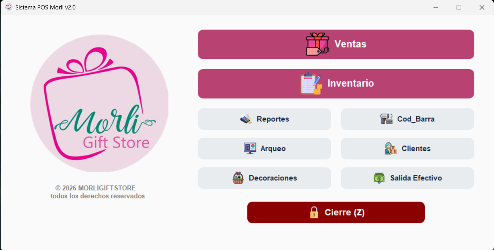
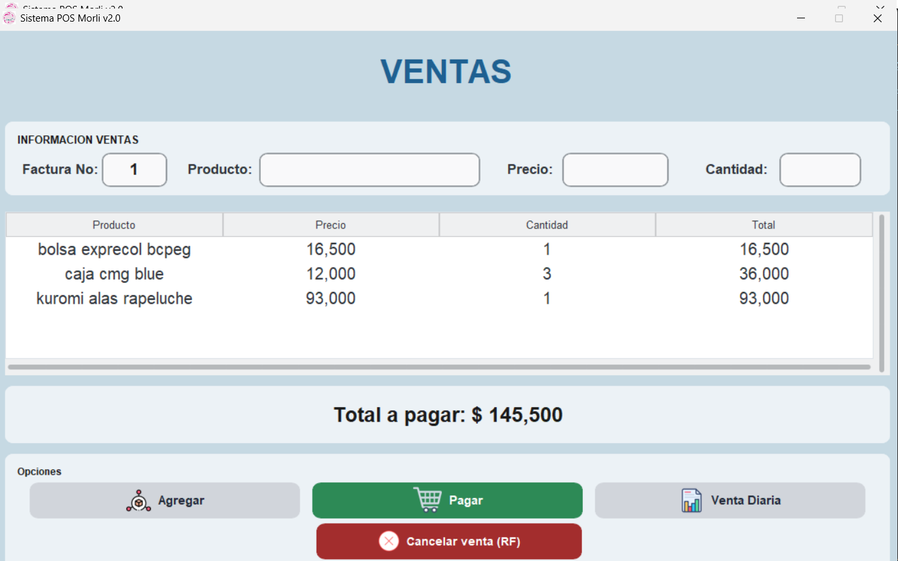
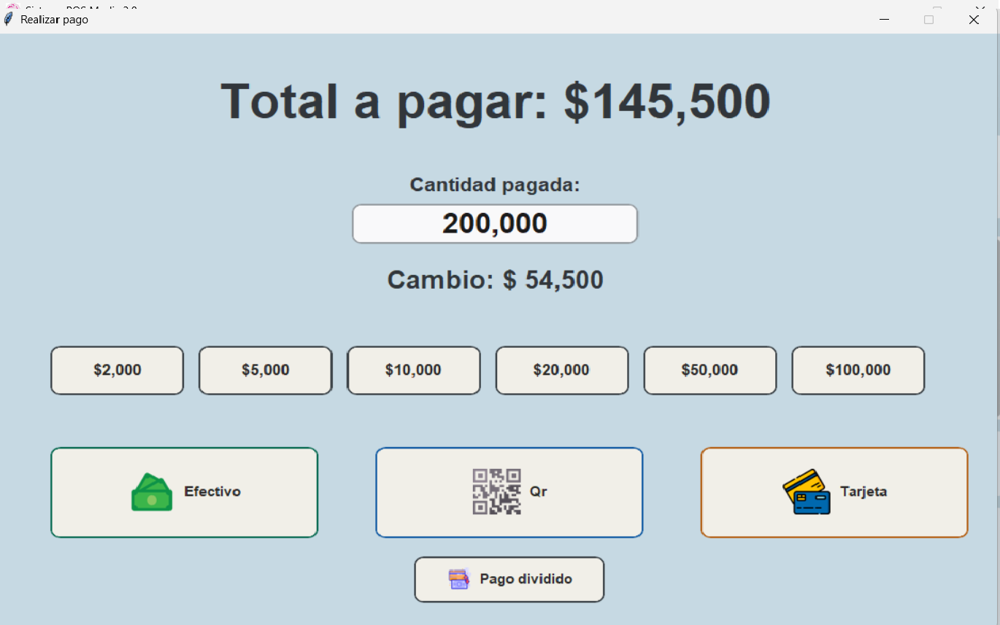
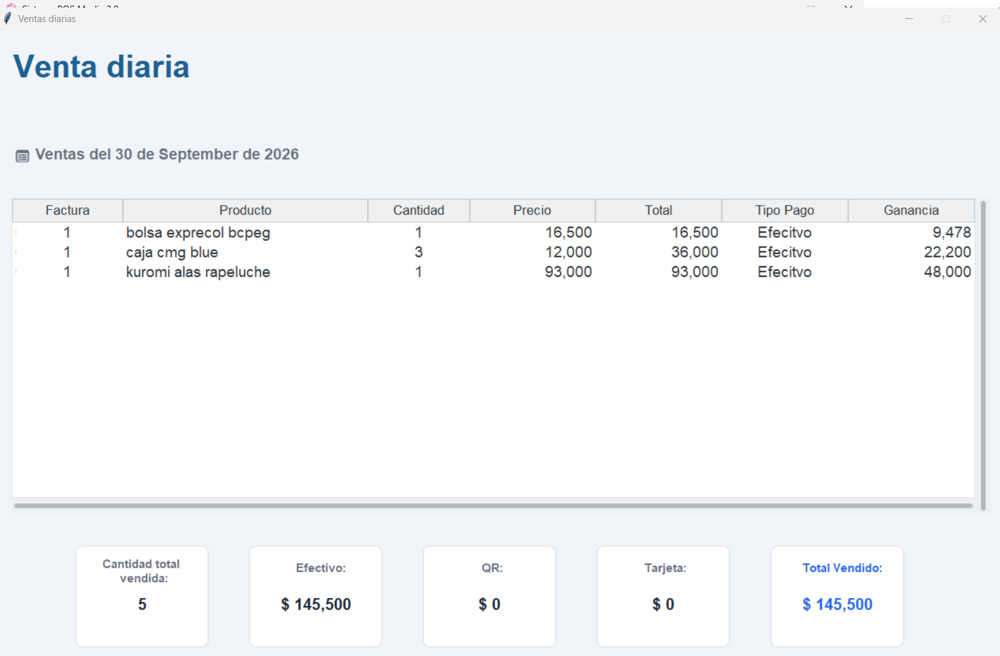
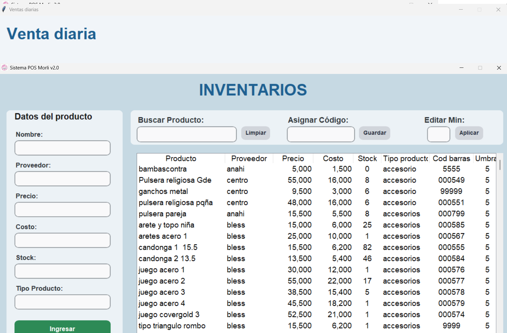
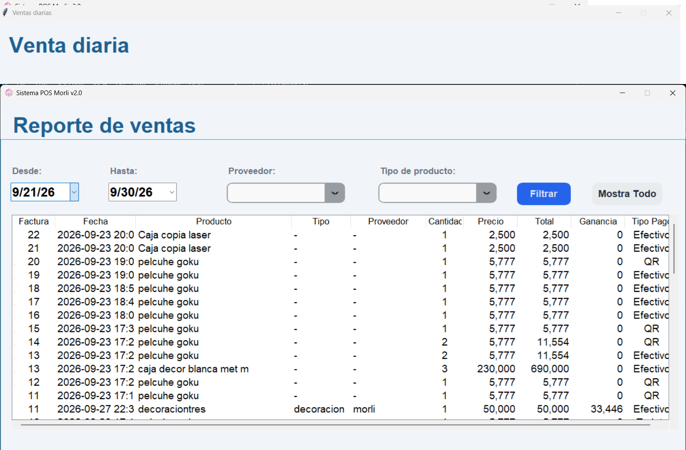

#  MORLIGIFTSTORE POS — Versión 2
## Description
Point of sale (POS) system for the comprehensive management of a gift shop. It allows registering sales with a barcode reader, managing inventory, managing customers, creating gift baskets/decorations, generating invoices, and printing tickets on a thermal printer. It includes a module to view sales with their respective profit.

Version 2.0 — Second iteration of the system, with improvements to the interface, process optimization, and new features.

## What is Version 2?
This is the second version of the system. Unlike Version 1, it focuses on:

-Cleaner and more organized code.
-Visually improved interface with CustomTkinter (ctk).
-Greater robustness.

## Technologies used

- **Python** — main language of the project.
- **Tkinter / CustomTkinter (ctk)** — desktop graphical interface, with modern components.
- **SQLite** —local database.
- **ReportLab** — generation of invoices and labels in PDF.
- **win32print** — thermal POS printing and cash drawer opening.
- **Modular architecture** — separation into views, logic, and utilities.

## Project structure
```
POS MORLI/
│
├── assets/
│   ├── icons/
│   └── images/
│
├── core/
│   ├── container.py
│   ├── cortez.py
│   ├── impresora.py
│   ├── manager.py
│   └── rf.py
│
├── corte_z/
│
├── database/
│   ├── codigos_db.py
│   ├── conexion.py
│   ├── corte_z_db.py
│   ├── decoraciones_db.py
│   ├── inventario_db.py
│   ├── reportes_db.py
│   ├── rf_db.py
│   ├── salida_efectivo_db.py
│   └── ventas_db.py
│
├── utils/
│   ├── generador.py
│   └── rutas.py
│
├── views/
│   ├── codigos.py
│   ├── decoraciones.py
│   ├── inventario.py
│   ├── pago.py
│   ├── reportes.py
│   ├── salida_efectivo.py
│   ├── venta_diaria.py
│   └── ventas.py
│
├── database.db
├── icono.ico
├── index.py
├── POSMorli.spec
└── README.md

```
## Technical explanation

The system was developed in Python, with a graphical interface in Tkinter and a local database in SQLite.

The project follows a modular architecture that separates responsibilities:

- **Views:** contains the system windows: sales, inventory, gift baskets, barcode assignment, daily sales, payment, cash withdrawal, reports, and the main container.
- **Logic:** contains business operations and reports: Z cut, cancellations (RF), ticket printing, and database access.
- **Database:** contains the data access layer: connection and queries for inventory, sales, codes, gift baskets, reports, cash withdrawal,     RF, and Z cut.
- **Utilities:** auxiliary tools, such as path handling and PDF generation.


### General system flow

1. The seller registers products using the barcode reader or by manual search.
2. At checkout, the system accepts payment in cash, QR, card, or split payment.
3. The sale is saved in the database, stock is deducted, and the invoice is generated in PDF.
4. The ticket is printed on the thermal printer and, if payment is in cash, the cash drawer opens.
5. At the end of the day, the Z Cut is performed, which generates the cash summary and closes the day.
6. The administrator can consult reports on profit, inventory, and full accounting.

## Evidence







